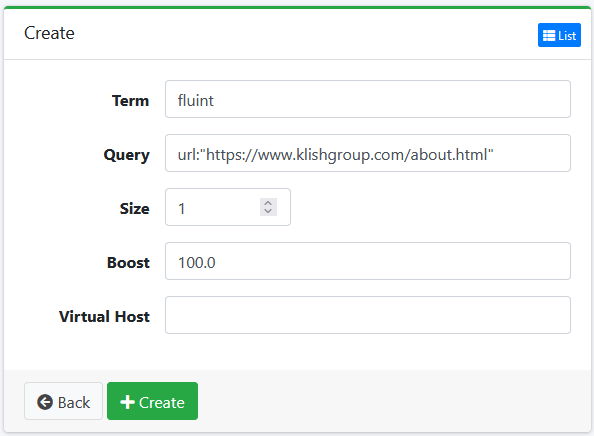
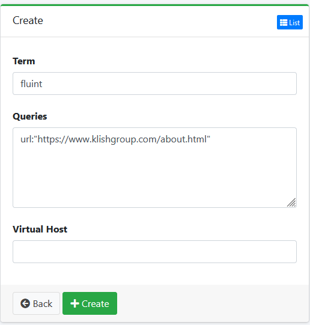

# Pinning Results

To pin results to the top of the search results, you can use a combination of `Key Match` and `Related Query`. This will allow you to pin specific results to the top of the search results based on a query or keyword.

## Key Match

Use this feature to push results to the top of the search results.

**Note:** that if the content is not in the search results, it will not be pinned.

### Navigate to `System` -> `Key Match` and click the `New` button.

### Configure the Key Match settings

- **Term**: The term to match in the search results.
- **Size**: The number of results to pin to the top of the search results. (set to 1 if unknown)
- **Query**: The query to match the term. (query parameters for Fess's Opensearch API request)
- **Boost**: The boost value to apply to the term.
- **Virtual Host**: The virtual host to apply the key match to. (optional)

This example below will pin the about page to the top of the search results when the term `fluint` is searched.

## Related Query

Related Query is used to match a query to a specific term. This can be used to add URLs to the search results that are not initially in the search results. For example the about page does not contain the term `fluint` but can be pinned to the top of the search results using the Related Query with Key Match.

## Notes

Need more information about how the size & query sections of Key Match work. Not well documented in the Fess documentation. Is the query just allow for parameters? or is it java/groovy statements?
