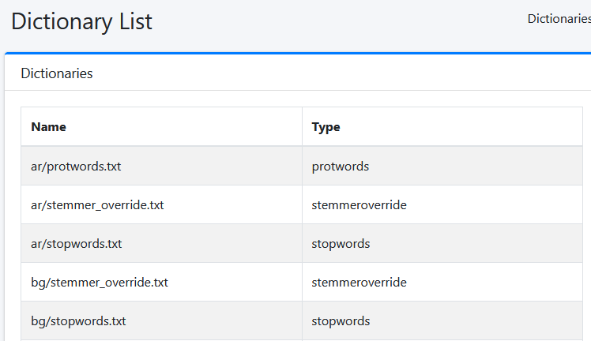
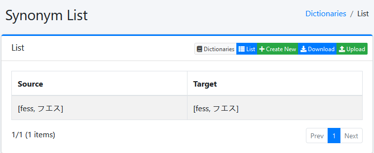
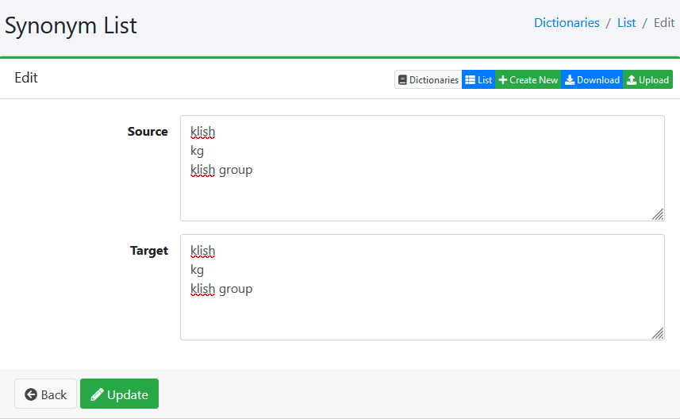
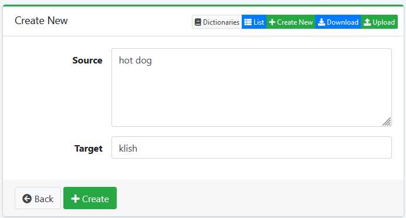

# Synonyms

Fess has a built-in feature to handle synonyms. This allows you to define synonyms for specific terms that will be used in the search query. This can be useful for handling common misspellings or variations of a term. By default there are some language-specific synonyms included in Fess. These can be ignored or modified as needed.

## Adding Synonyms

To add synonyms to Fess, you need to add synonyms to the `synonyms.txt` & `mapping.txt` file. These can be found under `System` -> `Dictionary` -> `synonym.txt` in the Fess dashboard.





These synonyms use the same format as Solr synonyms. Each line represents a synonym in the format `term, synonym1, synonym2, ...`. The terms are separated by commas.



After creating the synonyms, you need to reload the document index. `System Info` -> `Maintenance` -> `Reload Doc Index`.

You can use OpenSearch API to query the index directly to see the synonyms in action.

```bash
curl -X GET "localhost:9200/fess.search/_search?pretty=true" -H 'Content-Type: application/json' -d'
{
  "query": {
    "match": {
      "content": "klish"
    }
  },
  "explain": true
}
'
```

## Adding Mappings

Mappings are used to define the target of the synonyms. This is done by defining a `Target` for the synonyms. This can be a field in the document or a specific term. The `Target` is defined in the `mapping.txt` file. This will allow replacement of terms in a query with the `Target` term.

This example will replace the term `hot dog` with `klish` in the search query.



After creating the mappings, you need to reload the document index. `System Info` -> `Maintenance` -> `Reload Doc Index`.

You can use OpenSearch API to query the index directly to see the synonyms in action.

```bash
curl -X GET "localhost:9200/fess.search/_search?pretty=true" -H 'Content-Type: application/json' -d'
{
  "query": {
    "match": {
      "content": "hot dog"
    }
  },
  "explain": true
}
'
```

## Dictionary Save Location

The dictionary active is saved inside OpenSearch in the `config/dictonary` index. Files in fess are only ran at initial startup and are not saved to Fess's filesystem. This means that if you make changes to the dictionary, it will not carry over these changes to files in `fess_indices` in the webapp. Fess provides several ways of managing the dictionary, including uploading a file or using the API. See the [Fess documentation](https://fess.codelibs.org/overview.html) for more information.

## Notes

Struggling to understand why synonyms need a `Source` & `Target`. This makes sense for the Mapping section, but not the synonyms. Does this have to do with before/after indexing? The Fess documentation does not provide much information on this.
