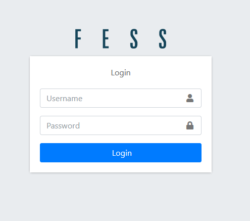
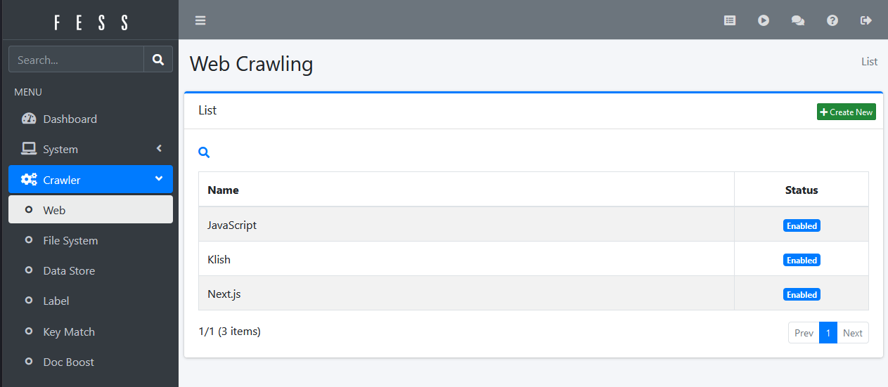
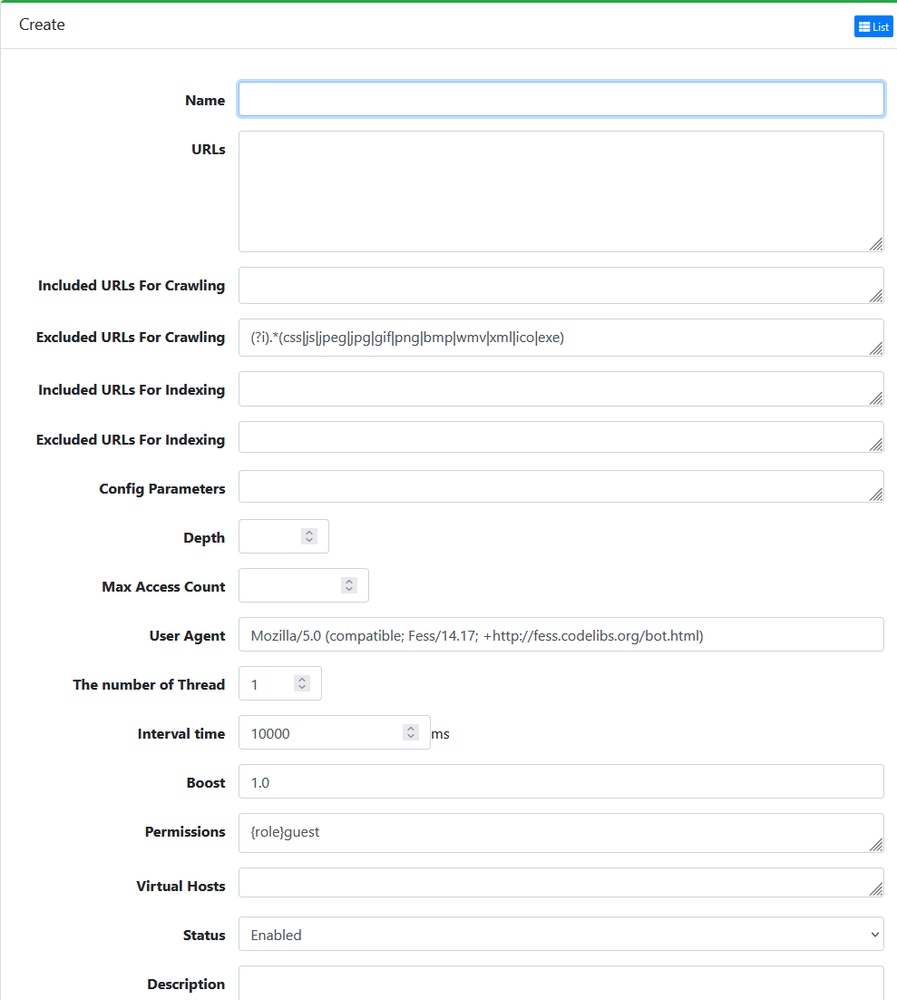
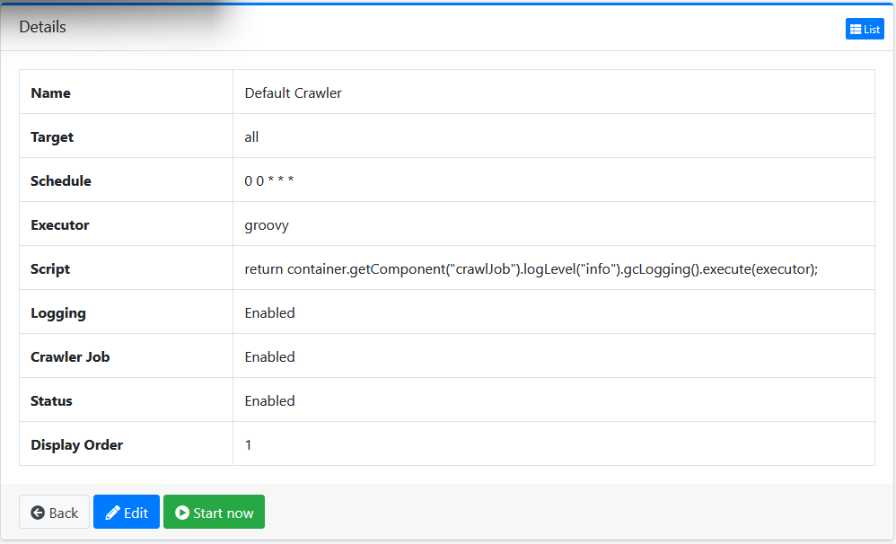

# Configuring a New Web Crawler

## Getting Started

### Navigate to the [Fess Dashboard](http://localhost:8080/login) and login with the default credentials `admin/admin`



### Navigate to the `Cralwer` -> `Web`. Create a new crawler by clicking the `New` button.



### Configure Crawler Settings  

The following settings are required:
- **Name**: A unique name for the crawler.
- **URL**: A list of URLs or URL to crawl. (Each URL on a new line)
- **Num of Thread**: The number of threads to use for crawling. (Default is `1`)
- **Interval Time**: The interval time between requests.
- **Max Access Count**: The maximum number of pages to crawl.
- **Depth**: The depth of the crawler.

Make sure to add regex patterns to the `Included/Excluded URL` fields to filter out unwanted URLs.
If nothing is specified, the crawler will crawl all URLs on the page, including external links. Make sure to add a wildcard pattern at the end of the URL to crawl all subpages.
(`https?://(.*\.)?example.com/.*` - crawl URLs on the `example.com` domain and all subdomains)



### Start the Crawler

Navigate to `System` -> `Jobs` Click the `Start` button to start the default crawler. The crawler will begin crawling the specified URLs and indexing the content. You can change the log level in the `Script` if you would like to see more detailed logs on what the crawler is doing.



## Important Config Parameters

The configuration parameters for the web crawler can be found in the `fess_config.properties` inside the Fess container. The default location is `/opt/fess/app/WEB-INF/classes/fess_config.properties`. They can also be modified using `bulk` config backups. These can be modified per crawler or globally. These properties are not well documented in the Fess documentation, so some important ones are listed below:

### Crawling Dynamic Content

To crawl dynamic content like client-side rendered pages, the `playwright` library is required. This is not included in the default Fess Docker image. To add this dependency, you can use the custom Fess Docker image provided in this POC. The `playwright` library is required for indexing dynamic content.

Once the `playwright` library is added, add the following config parameter to your crawler settings:

```properties
client.crawlerClients=playwright:http://.*,playwright:https://.*
```
